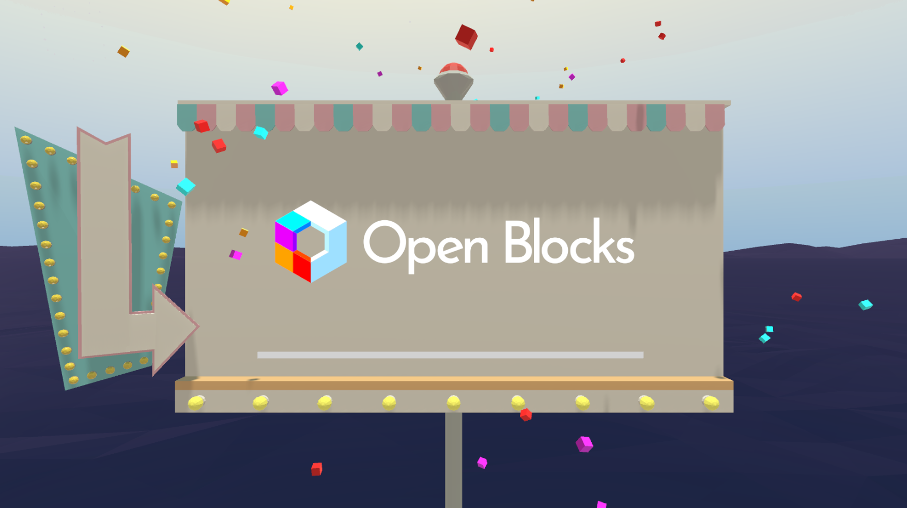

# Open Blocks - 3D Modelling for Everyone

Open Blocks is a free fork of Blocks by Google, An app designed to make creating 3D models fun, easy, and accessible. We are in the process of making large number of changes. Please check our progress and our roadmap on our [docs site](https://docs.openblocks.app).

We hope to maintain and improve upon Blocks as a community-led project, free forever!

As the original repo is archived we cannot submit PRs, so feel free to submit them here!

[User Guide](https://docs.openblocks.app/)  
[Please join the Icosa Discord and get involved!](https://discord.com/invite/W7NCEYnEfy)  
[Support us on Open Collective](https://opencollective.com/icosa)

## Downloads
### Stores
(Coming Soon)

### GitHub
- [Formal GitHub Releases](https://github.com/icosa-foundation/open-blocks/releases/latest)

Note that despite a Windows build, it does work on Linux. For example one can add as a non-Steam game to their library, force compatibility with Proton experimental and run Open Blocks as-is, without any modification.

## Acknowledgements
* Thank you to the original developers for your amazing work and for finding a way to open source the app!

## Important note from the original Blocks README

The Blocks trademark and logo (“Blocks Trademarks”) are trademarks of
Google, and are treated separately from the copyright or patent license grants
contained in the Apache-licensed Blocks repositories on GitHub. Any use of
the Blocks Trademarks other than those permitted in these guidelines must be
approved in advance.

For more information, read the
[Blocks Brand Guidelines](BRAND_GUIDELINES.md).

---
### Changing the application name

_Blocks_ is a Google trademark. If you intend to publish a cloned version of
the application, you are required to choose a different name to distinguish it
from the official version. Before building the application, go into `App.cs` and
the Player settings to change the company and application names to your own.

Please see the [Blocks Brand Guidelines](BRAND_GUIDELINES.md) for more details.

## Systems that were replaced or removed when open-sourcing Blocks

Some systems in Blocks were removed or replaced with alternatives due to
open-source licensing issues. These are:

* AnimatedGifEncoder32
* LZWEncoder

